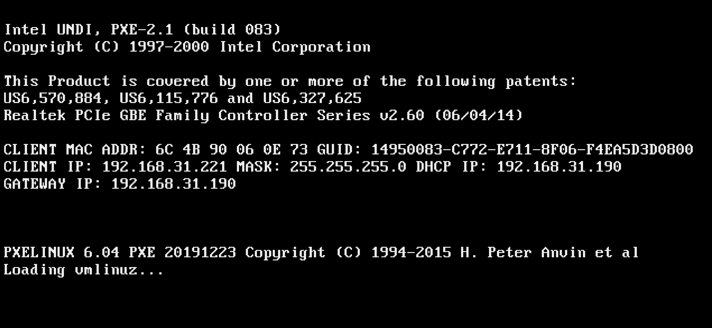
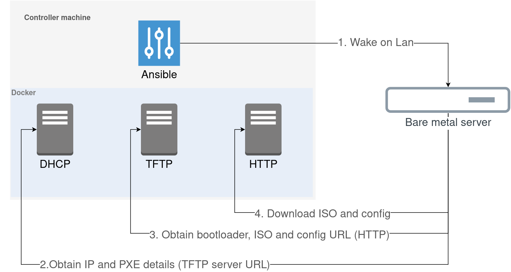

In this post we will install Ubuntu Server 20.04 on multiple mini PCs.

Usually, the OS installation requires an installation medium - a USB drive or a CD-ROM. This method is convenient and reliable, but sometimes there is a need to install an OS on many machines at once or those that are not physically accessible. For such purposes, there is a possibility to install the OS over the network. For those purposes, we can use PXE - Preboot eXecution Environment technology.

##### PXE environment

The PXE environment is the process of having your device boot from its network card. 
To boot the device into the PXE environment, the device should get an instructions such as where to take a config and OS image. 

We are going to create the PXE environment inside our network.

##### Prerequisites

###### Initial controller

> The initial controller is the machine used to bootstrap the servers, we only need it once, you can use your laptop or desktop

A Linux machine that can run Docker (because the host networking driver used for PXE boot only supports Linux, you can use a Linux virtual machine with bridged networking if you're on macOS or Windows).

The following ports should be free and not blocked by firewall:

| service | port    | protocol |
|---------|---------|----------|
| DHCP    | 67      | UDP      |
| TFTP    | 69      | UDP      |
| HTTP    | 80      | TCP      |
| DNS     | 53      | TCP/UDP  |  

###### Tools

- [Ansible](https://docs.ansible.com/ansible/latest/installation_guide/intro_installation.html)
- [Docker](https://docs.docker.com/engine/install/) and [docker-compose](https://docs.docker.com/compose/install/)

###### Server machines 

Any modern x86_64 computer(s) should work, you can use old PCs, laptops or servers, but they should support:
  - PXE boot - ability to boot from the network
  - Wake-on-LAN capability - used to wake the machines up automatically without physically touching the power butto

##### OS Installation

Ansible + Docker are used to create a working PXE environment. All the required servers is running on Docker. 

Ansible is used to make an initial configuration (network config, download and mount ISO image, etc) of the PXE environment and trigger the device to power on.

To start PXE environment and trigger the devices to boot, you just need to [run the Ansible playbook](https://github.com/spetriuk/dev-lab-project/tree/master/os/install).

After the environment is ready, the servers boot process will be initiated by powering them on using Wake On Lan, and the server will boot in PXE mode:

The installation process is as follows:

1. We send a Wake on Lan package to turn on the device. Device is configured to boot from PXE (via BIOS)
2. The device ask a DHCP server (configured to know PXE server details) for an IP and the TFTP server address
3. The device fetch the bootloader (boot configuration, kernel, initial ramdisk) and the HTTP server address.
4. Then it fetch the installation configuration (such as initial user to create, network configuration, system language, etc) and an OS iso image to install. After that, the OS installation started in automatic mode.

