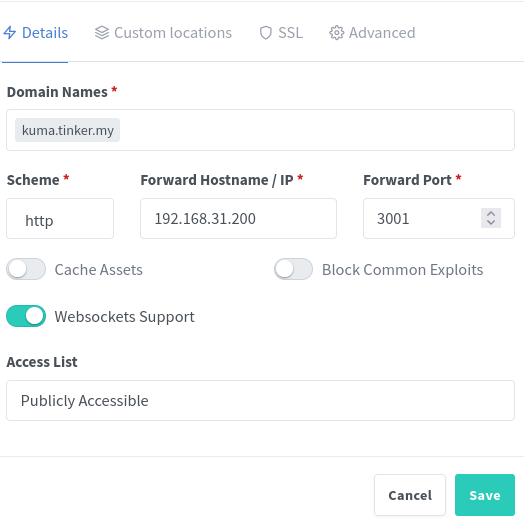

How to easilly deploy nginx proxy server and configure it using UI only. No config files!

##### What is reverse proxy?

A reverse proxy is a server that sits in front of web servers and forwards client requests to those web servers. 

As a small example, it can be used as a single entry point, listening port 443 and forwarding requests to servers which are listening on different ports. Assume we have a server `192.168.0.200`, and 2 web servers working on this host: `192.168.0.200:8080`, `192.168.0.200:9090`. We want to have a nice URLs for those services, and created a domain `myserver.com`. It is not handy to use `myserver.com:8080`, or `myserver.com:9090`, and we want to protect our services with https. The solution will be to deploy a third service - a reverse proxy, which will listen 443, and route requests to the servers based by request url. Each time reverse proxy receives a request `service1.myserver.com` it will route it to `192.168.0.200:8080`, requests `service2.myserver.com` will be routed to `192.168.0.200:9090`.

The benefits of a reverse proxy:

- **Load balancing** -  a reverse proxy can distribute the incoming traffic evenly among the different servers.
- **Protection from attacks** - a web site never needs to reveal the IP address of their origin server(s).
- **Global Server Load Balancing (GSLB)** - in this form of load balancing, a website can be distributed on several servers around the globe and the reverse proxy will send clients to the server that’s geographically closest to them.
- **Caching** - a reverse proxy can also cache content, resulting in faster performance.
- **SSL encryption** - a reverse proxy can be configured to decrypt all incoming requests and encrypt all outgoing responses, freeing up valuable resources on the origin server.

Here is a good article from Cloudflare explaining reverse prxoxy: [https://www.cloudflare.com/learning/cdn/glossary/reverse-proxy/](https://www.cloudflare.com/learning/cdn/glossary/reverse-proxy/).


##### Nginx Proxy Manager

[Nginx Proxy Manager](https://nginxproxymanager.com/) is a NGINX proxy server with easy to use UI. It comes as a pre-built docker image that enables you to easily forward to your websites running at home or otherwise, including free SSL, without having to know too much about Nginx or Letsencrypt.

To deploy with docker-compose, create a docker-compose.yaml file:

```yaml
version: '3'
services:
  app:
    image: 'jc21/nginx-proxy-manager:latest'
    restart: unless-stopped
    ports:
      - '80:80'
      - '81:81'
      - '443:443'
    volumes:
      - ./data:/data
      - ./letsencrypt:/etc/letsencrypt
```

And run the command:

```sh
docker-compose up -d
```

##### How to add a new proxy to the Nginx Proxy Manager

<!-- TODO Add articles on Pihole, AdGuardHome, How to add DNS record -->
First, you need to add a DNS record with domain, pointing to Nginx Proxy IP address. For DNS configuration see **Private DNS server and ad-blocker using Pihole**, or **Private DNS and newtwork-wide ad-blocker using andAdGuard Home**.
<!-- TODO Add DNS record description -->

Then, add a new new proxy, click Add Proxy Host:



Add a desired domain name which is going to be used for your server, and destination ip/hostname:port - the real address of your server. All the requests for the url <!-- TODO add url --> now should be routed to the server.

After you save it, your service is accessible on your selected domain name.