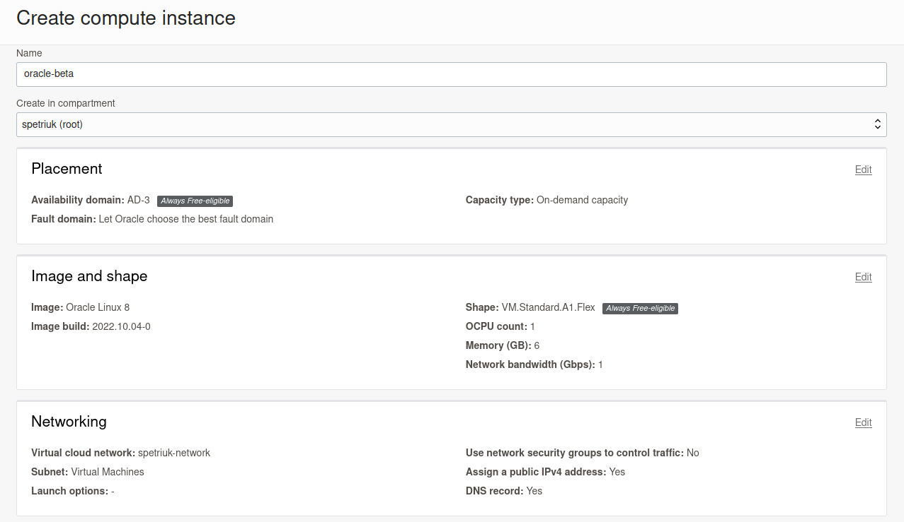
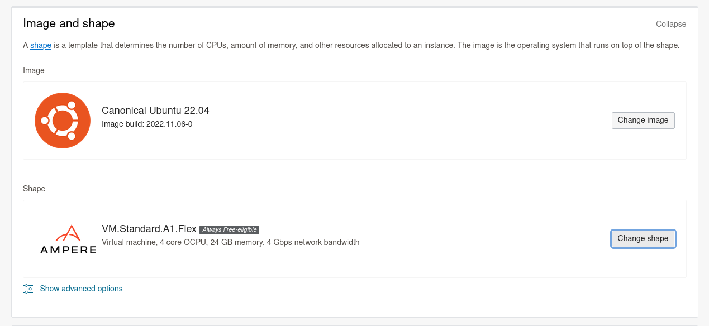
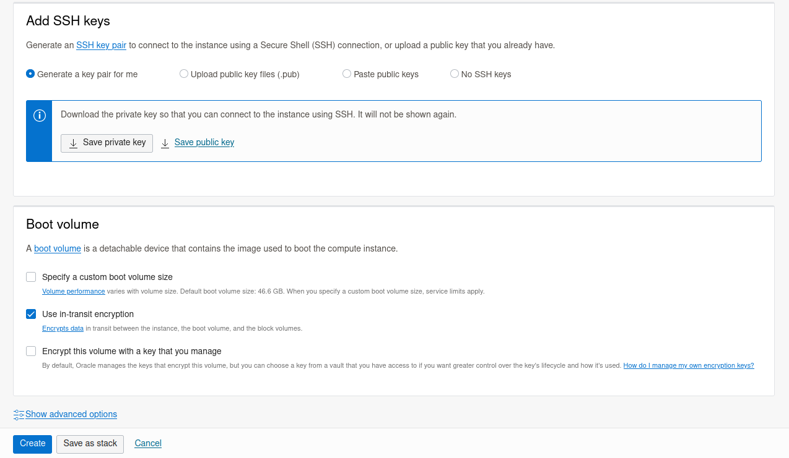
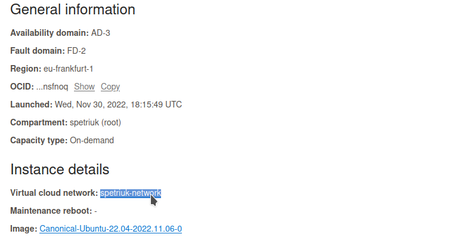
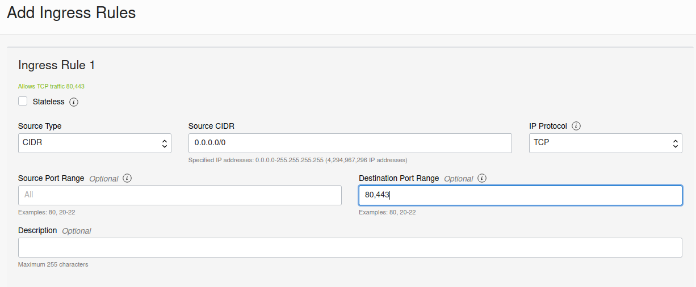

4 cores, 24GB Memory ARM server for free!

#### Create the instance
First, you need to create an account on [Oracle Cloud](https://www.oracle.com/cloud/free/). You need a valid email and a credit card with minimum 1EUR on it. 

During the registration process, you will be asked to select your home region. By default, all resources will be created in it, to create resources in other regions, you will need to subscribe to them. However for Free Tier, only one (home) region subscription is allowed. So it’s better to choose as your home region the region with which you have the best bandwidth of communication channels or the minimum signal delay. There is a service to test the speed of the connection to Oracle Cloud Infrastructure: [https://cloudharmony.com/speedtest-for-oracle](https://cloudharmony.com/speedtest-for-oracle).

While creating an instance you need to specify shape (machine), and image (OS)



Available Shapes

- **Micro instances (AMD processor)**: All tenancies get up to two Always Free VM instances using the VM.Standard.E2.1.Micro shape, which has an AMD processor.
- **Ampere A1 Compute instances (Arm processor)**: All tenancies get the first 3,000 OCPU hours and 18,000 GB hours per month for free for VM instances using the VM. Standard.A1.Flex shape, which has an Arm processor. For Always Free tenancies, this is equivalent to 4 OCPUs and 24 GB of memory




There are a few options for SSH access to the server. The easiest way is to download the generated key and use it later.



Press Create, and that's it, your server is created. You will see a public IP address which is going to be used to connect the server using SSH:

```bash
ssh ubuntu@144.24.170.198 -i ~/.ssh/oracle-ssh-key.key
```

#### Open ports

Ports 80 and 443 will be closed by default. If you plan to add websites to the server, open port 80 and 443 by clicking on Virtual Cloud Network from the server instance details screen.



Click on the security list -> Add Ingress Rules. Add the following source and port:


By default all the Oracle OS images use iptables, and you need to open the ports on the OS level, for that SSH into the server and run the following terminal commands:

```bash
iptables -I INPUT 6 -m state --state NEW -p tcp --dport 443 -j ACCEPT
iptables -I INPUT 6 -m state --state NEW -p tcp --dport 80 -j ACCEPT
netfilter-persistent save
```

This will update the iptables to allow ports `443` and `80`.