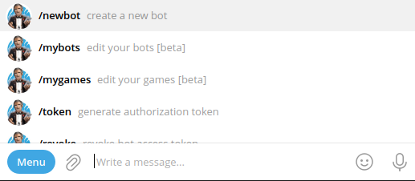

> We are going to monitor the power outages in the appartment and send Telegram notifications whe the power switches on/off. To know if the appartment has the electricity we are going to ping the router. 

#### Set up DDNS

In my case I don't have a staic IP address, so to have the permanent link to the router, we are going to set up DDNS on the router. 

DDNS (Dynamic DNS) is an automatic method of refreshing a name server. It is a service that automatically and periodically updates your DNS’s records when your IP address changes. These IP changes are made by your Internet provider.

The process described here for my router - Xiaomi 4A. The process will differ for another models, some have vendor owned DDNS services, so the set up could be event easier. 

As a DDNS provider we are going to use [no-ip](https://www.noip.com/). You need to register an account on [noip.com](https://www.noip.com/), and add a a host.


Check that your public IP address is a target of DDNS record you just created.


Then add your no-ip account details to the router settings.


When you try to access the hostmane ([myrouterhostname.ddns.net](http://myrouterhostname.ddns.net)) in browser, you should be redirected to you router's Web UI page. It is now opened to the Internet, so take care to set the strong password to avoid bruteforce attacks.


#### Deploy Uptime Kuma instance

We are going to deploy the [Uptime Kuma](https://github.com/louislam/uptime-kuma) - a self-hosted monitoring tool, which can send notifications to Telegram, and 90+ notification services, [check the full list](https://github.com/louislam/uptime-kuma/tree/master/src/components/notifications). It will ping our router and send notification in case it's state changed.

The Uptime Kuma service should be deployed to the cloud, so it will be available 24/7. We will use Oracle cloud as it provides a always free instances. To create a free instance check [Always-free server on Oracle Cloud](../oracle-cloud-free-server).

> Before deploying Uptime Kuma make sure you have docker and docker-compose installed on your server. Installation instructions can be found on [official Docker site](https://docs.docker.com/engine/install/).

SSH to your server, then create a dcoker-compose.yaml file:
```sh
touch docker-compose.yaml
```

Open the file in any editor, we will use nano:
```sh
nano docker-compose.yaml
```

Paste the docker compose configuration for Uptime Kuma:
```yaml
version: "3"
services:
  kuma:
    image: louislam/uptime-kuma
    container_name: kuma
    volumes:
      - /home/ubuntu/docker/kuma/data:/app/data
    ports:
      - 3001:3001
    restart: unless-stopped
    security_opt:
      - no-new-privileges:true
```

Save and close the file `Ctrl+S` and `Ctrl+X`.

Start the service:
```sh
docker-compose up -d
```

Now the service should be accessible by your server's public IP on port `3001`. Go to `SERVER_IP:3001` in your browser, and create an account with an email and password. If the pege is not loading make sure you have port `3001` opened on your server.


#### Add monitor

After you sign in, click Add new monitor:


After monitor added you should see ping status updating with given interval:


#### Add Telegram notifications

Next, let's add Telegram notifications. For this we will create a telegram bot.

Open [https://t.me/BotFather](https://t.me/BotFather) in your Telegram client or search `@BotFather` in Telegram app. From the bot menu choose `/newbot`, or send `/newbot` as a message:




Enter a bot name, and that's it, your bot is created. You should start a conversation with your bot. 


Click on [http://t.me/MyPowerOutageBot](http://t.me/MyPowerOutageBot) from mesage and press start, or send a `/start` message:


In Uptime Kuma click Edit -> Setup Notification, choose Telegram, enter the notification name. Copy the bot's token from the message fom the `@BotFater`, for the chat ID click `Auto Get`. If you press `Test`, you shoud recieve the test message from your bot:


Save the notification and the power outage alert system is ready. Now you should receive the notifications if the power in your appartment is on and off:


#### Add Telegram notifications to Group chat

We can reconfigure Kuma to use the GroupID instead of ChatID

To get the GroupID:

1. Add the bot to the group. Go to the group, click on group name, click on Add members, in the search box search for your bot like this: "@my_bot", select your bot and click add. Then make the bot admin

2. Send a dummy message to the bot. You can use this example: /hello @my_bot

3. Go to following URL: https://api.telegram.org/botXXX:YYYY/getUpdates replace XXX:YYYY with your bot token

4. Look for "chat":{"id":-zzzzzzzzzz, -zzzzzzzzzz is your chat id (with the negative sign).

