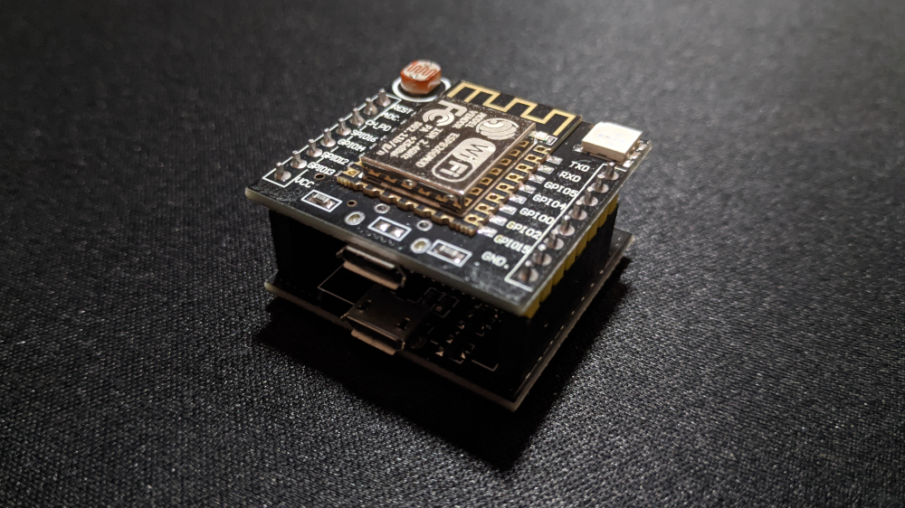

> How to check if there is electricity supply in a location that coludn't be pinged from outside the network: the hardware way.


Last time I made a monitoring system of the the power outages in the appartment with Telegram notifications. Check [Power outage monitoring using Uptime Kuma](../power-outage-monitoring). The system requires the permanent link to the appartment's router, that are pinged from the server. 

But what if there is no control over network, or the network is private and cannot be pinged from outside? 

At some point, it became necessary to monitor the availability of electricity in the office where I work, and where is no way to get a static ip address that could be pinged. The possible solution is to send the ping signal to the server from the inside of the network.

For this purpose we are going to use the cheap device [ESP8266 Witty Cloud](https://arduino.ua/prod1417-wi-fi-modyl-esp8266-witty), which price is under 4$. **ESP8266 Witty Cloud** is a freely programmable microcontroller with builtin WiFi. More technical details you can check on [Wikipedia](https://en.wikipedia.org/wiki/ESP8266). The ESP8266 will connect to wifi, and perform the HTTPS request to the server with the given interval.


#### Seting up the server

We are going to use Uptime Kuma as a monitoring server. Check [Power outage monitoring using Uptime Kuma](../power-outage-monitoring) for installation instcutions. 

First, we need to obtain an URL which is going to be used to send the requests indicating the device uptime. 

Fortunately, Uptime Kuma has such a fature, called `Passive monitoring`. Let's create our monitor using web UI. `Click Add new monitor`, select monitor type `Push`, enter a monitor name and minimal interval - the Uptime Kuma will generate an url for us, and will listen for the incoming requests by that url. 

If there will be at least one request in the given time window (Heartbeat Interval), the monitor will indicate UP state, if no requests, the monitor will be in DOWN state. At this step we need to copy the generated URL and save the monitor:


#### Setting up the hardware



The ESP8266 Witty Cloud consists of two stacked PCB's, the bottom one is used for firmware update, we don't need it here, we will use only the main module with the ESP8266 itself. Connect the module to the computer usind micro USB cable.

I suggest using the [Arduino IDE](https://www.arduino.cc/en/software), it’s very easy to use, even for beginners. First, install the [ESP8266 extensions](https://arduino-esp8266.readthedocs.io/en/latest/installing.html) to the Arduino IDE. After that it’s best to select **WeMos D1-Mini** in the board manager as a device.


Copy the code to the IDE:

```cpp
#include <ESP8266WiFi.h>

const char* ssid     = "your-wifi-hotspot-name";
const char* password = "your-wifi-password";

const char* host = "kuma.example.com"; // Uptime Kuma host, use only kuma.example.com not https://kuma.example.com
const int interval = 20000; // ping interval in ms

void setup() {
  Serial.begin(115200);
  delay(10);

  Serial.println();
  Serial.print("Connecting to ");
  Serial.println(ssid);

  WiFi.begin(ssid, password);

  while (WiFi.status() != WL_CONNECTED) {
    delay(500);
    Serial.print(".");
  }

  Serial.println("");
  Serial.println("WiFi connected");  
  Serial.print("IP address: ");
  Serial.println(WiFi.localIP());
}

void loop() {
  delay(interval);

  // Use WiFiClient class to create TCP connections
  WiFiClientSecure client;
  client.setInsecure(); 

  const int httpPort = 443;

  if (!client.connect(host, httpPort)) {
    Serial.println("Connection failed");
    return;
  }

  // URI for the request (generated by Uptime Kuma)
  String url = "/api/push/HYUGUYV7de?status=up&msg=OK&ping=1";

  Serial.print("Requesting URL: ");
  Serial.print(host);
  Serial.println(url);

  // This will send the request to the server
  client.print(String("GET ") + url + " HTTP/1.1\r\n" +
               "Host: " + host + "\r\n" + 
               "Connection: close\r\n\r\n");

  Serial.println();
}
```

> The ping interval should be selected with the expectation that there could be some delays in performing the request due to the internet connection lags or other issues, so if you specified 60 seconds in the Kuma monitor, consider making the interval less than 60 secons in case of slow requests. It is better to hit the monitor multiple times per time window, rather than having false-positive DOWN notification. Additionaly, you can add retries to Kuma monitor, so if you have 2 or 3 consequent DOWN singnals, only after tthat the monitor should report DOWN state.

Upload the code to the device. Make sure device is selected in Arduino IDE (board type and port) and press upload. 

If you use Linux, it is possible you can have an error like this:
```
can't open device "/dev/ttyUSB0": Permission denied
```

In this case you should allow the IDE to access the port with command:
```
sudo chmod a+rw /dev/ttyUSB0
```

After the program is uploaded, open the Serial Monitor (`Tools` -> `Serial monitor`), in the serial monitor select the corresponding baud (we use 115200 in our program) and you should see the program execution logs:


The requests now should be represented in Uptime Kuma monitor:


#### Telegram notifications

For setting up the Telegram notfications see [Power outage monitoring using Uptime Kuma](../power-outage-monitoring).