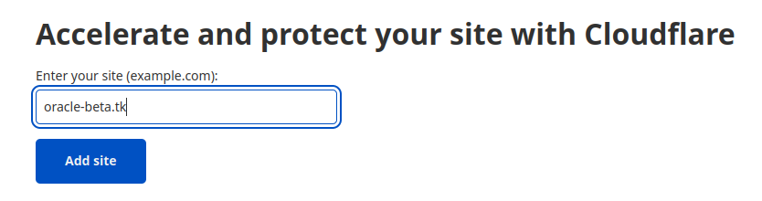

> Setting up a free domain name with subdomains and HTTPS enabled

First of all, you need a server. You can get one for free from Oracle, see [Always-free server on Oracle Cloud](../oracle-cloud-free-server).

As you have a server, the next step is to create a good looking domain name to access it. If you have multiple web services deployed, you also might want to set up multiple subdomains for them. For example, you have the server with an ip `192.168.20.100`, and 2 services `192.168.20.100:8080` for your api, and `192.168.20.100:9000` for documentation site. It is much better to have a domain name `myportal.com` with the following subdomains: `api.myportal.com` and `docs.myportal.com`. Also it would be great to have them protected with SSL.

#### Get a free domain

We are going to use [freenom.com](https://freenom.com) to get a free domain. You need to create an account and choose the domain you like.

Select free 12 months free plan, and proceed with you free order.

#### Add you domain to Cloudflare

We will use Cloudflare as DNS, and to protect our server using free features Cloudflare provides. 

Create an account, verify your email, add your domain.

Select free plan.

Add DNS records pointing to you server's public IP.

Enable security features, you can skip for now, it could be done later.

As a next step, Cloudflare will ask you to add it's nameservers to your domain name provider site. Copy the provided nameservers URLs.

Visit [freenom.com](https://freenom.com). Go to `Services` -> `My Domains` -> `Manage Domain`.

Go to `Management Tools` -> `Nameservers`, and paste the Cloudflare's nameservers URLs.

Save the settings, close the freenom site, you will not come back here for at least 12 months. Go back to Cloudflare, and enable full SSL encryption mode, and add your subdomains under DNS settings.

#### Set up reverse proxy

We are going to use a self-managed reverse prosy service to route the requests by subdomains to our services. It will allow us to keep the services ports closed from the world, and use internal IP to to rote the requests to them. My personal choice is [Nginx Proxy Manager](https://nginxproxymanager.com/), because it is easy to configure, everything cound be done via web UI, and it has a build-in Let's Encrypt support to obtains SSL Certificates fast and easily. See [Easy deploy of Ngix proxy server on Docker](../nginx-proxy-manager) for installation instructions.

In Nginx Proxy Manager add new host, use internal IP of the service

Before saving go to **SSL** tab, choose to request new certificate, and enter your email address. After clicking **Save**, the Nginx Proxy Manager could take a few seconds to get the certificate.

#### Check the result

After everything done, go to any of your subdomain URLs. If you access it by http, it should be redirected to https, and you will see a corresponding icon in your browser, which indicating that you site is protected.

> Make sure you closed you services ports to the world, all communication with them should be through the reverse proxy. All the requests will go to port 443, and will be redirected to destination under the hood.

